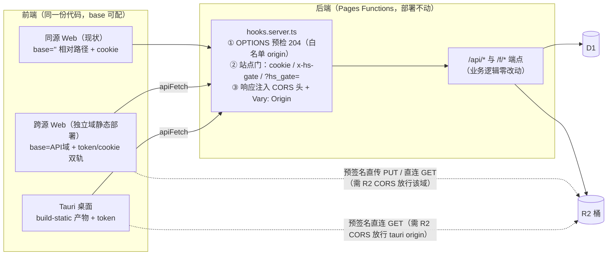
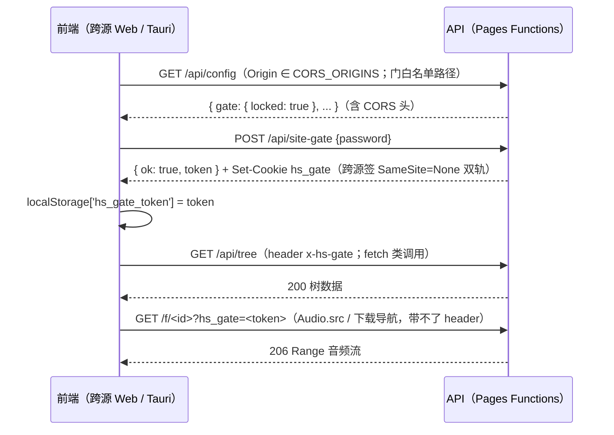

# 前后端分离架构（跨源 Web / Tauri 桌面 × Pages API）

> 前端可脱离同源后端独立运行：跨源静态部署、Tauri 包装成桌面端，都消费同一个 Pages Functions 后端。
> 本文是分离形态的架构总览与排障入口；桌面打包细节见 [desktop.md](./desktop.md)，运维配置见 [deployment.md](./deployment.md) 二节。
> 硬约束：**Pages Git 集成构建命令保持 `pnpm build`、schema.sql 零变更、不物理拆仓**——线上同源版部署零改动，分离是纯增量能力。

## 一、目标架构

同一份前端代码，三种形态：

后端改动面收敛在：hooks（CORS + 门凭证）、两个门签发端点（token 下发）、OAuth 两端点（跨源参数）、zip 清单一处 URL 拼法。全部端点业务语义、D1/R2 用法、子请求预算不变。

| 形态 | 连接配置 | 门凭证 | 登录/上传 |
| --- | --- | --- | --- |
| 同源 Web（现状） | 无（base=''） | `hs_gate` cookie | ✅ cookie（Lax） |
| 跨源 Web（https） | 齿轮填 API 域（入口显隐见二节） | cookie(None) + token 双轨 | ✅（SameSite=None + credentials include；Safari 不可用，见「七」） |
| Tauri 桌面 | 首启引导必填 | token（`x-hs-gate` 头 + `/f/` query）+ 会话 token（`x-hs-session` 头） | ✅ 全功能（登录走 `hs_code` 交换，见 3.3） |

## 二、API 客户端层（`src/lib/api-base.svelte.ts`）

全站**唯一**知道「服务器地址可配置」的模块；`api.ts` 与全部组件反向依赖它，模块自身不 import 业务模块（避免环）。状态存 localStorage：`hs_api_base`（base，空 = 同源）、`hs_gate_token`（门 token）、`hs_session_token`（登录态 token，`?hs_code=` 交换所得），Svelte 5 `$state` 整值赋值。

| 出口 | 语义 |
| --- | --- |
| `apiFetch(input, init)` | 统一 fetch 出口。绝对 http(s) URL（R2 预签名）→ 裸 fetch（不加 header/credentials——预签名只签了既定 headers，附加自定义头会签名失配）；相对路径 → 拼 base（空则原样）+ 有门 token 注入 `x-hs-gate`、有会话 token 注入 `x-hs-session`（并存）+ credentials `base ? 'include' : 'same-origin'`（base 空与 fetch 默认一致，同源零回归）。`cache:'reload'` 等 init 透传 |
| `absoluteApiUrl(path, withGate?)` | 给 Audio.src / 整页导航（带不了 header 的场合）构造完整 URL；有 token 且 path 以 `/f/` 前缀（或显式 `withGate=true`，登录链接用）时追加 `?hs_gate=<token>` |
| `fetchIssuedUrl(url, init)` | 服务端下发 URL（zip 清单 `urls` 值）三支分派：① 相对路径（旧后端形态）→ apiFetch；② 绝对 URL 且 origin === API base（新后端的 `/api/blob` 绝对回退 URL，受门保护）→ 剥 base 走 apiFetch（裸 fetch 会被门 401）；③ 其余绝对 URL（R2 预签名域）→ 裸 fetch |
| `loginUrl()` | 登录整页导航 URL：base + `/api/auth/login` + query（token 存在时 `hs_gate`、base 非空时 `hs_origin=<location.origin>`）。URLSearchParams 组装——无 token 时手拼 `'&'` 会产出坏 URL |
| `getApiBase` / `setApiBase` / `clearConnection` / `getGateToken` / `setGateToken` | 连接状态读写；`setApiBase` 规范化（trim、去尾 `/`、必须 http(s)），非法 throw `bad_url` |
| `isDesktopApp()` / `needsDesktopSetup()` / `showConnectionEntry()` | Tauri WebView 检测（`__TAURI_INTERNALS__` / `__TAURI__` 全局标记，纯检测零网络）；后者 = 桌面且未配 base（首启引导）；齿轮入口 = 桌面或已配 base（同源网页版隐藏） |

**连接设置 UI**（`src/lib/components/ConnectionSettings.svelte`，顶栏齿轮入口）：字段 = 服务器地址（留空 = 同源当前站点）+ 站点密码（`config.gate.locked` 时亮出）；「测试并保存」= setApiBase → fetchConfig →（locked 则 unlockSite）成功后整页 reload（换源后整树状态重建）；失败回显原因（`bad_url` / 不可达 / `wrong_password`）**并回滚连接改动**，不留半套状态打死地址。齿轮按「桌面模式或已配置服务器地址」显示（`showConnectionEntry()` = `isDesktopApp() || getApiBase()` 非空，`src/routes/+layout.svelte` 顶栏 actions 区）——同源网页版隐藏（纯 cookie 门轨用不到连接配置），已配置用户保留修改/断开入口；对可见用户，连接配置仍与上传能力正交，`uploadEnabled=false` 时恰恰最需要它。桌面首启：`needsDesktopSetup()` 时显示引导遮罩，点击打开连接设置。

## 三、鉴权

### 3.1 站点门：cookie + token 双轨

token 与 cookie 值**完全同构**（同为 `issueUnlockValue` 的产物 `<hash前16>.<HMAC>`，`src/lib/server/site-gate.ts`），验签复用 `verifyUnlockValue`——改密即全废的语义自动继承，无新签名结构。

- **三源凭证**：`pickGateCredential`（cookie ?? `x-hs-gate` 头 ?? `?hs_gate=` query，cookie 优先）——同源 Web 行为与纯 cookie 时代逐字节一致。**两处消费缺一不可**：hooks 门判定（`src/hooks.server.ts`）与 `/api/config` 的 `gate.locked`（后者在门白名单内自行验凭证，不接入则桌面解锁存 token 后 reload 仍 `locked:true`，遮罩死循环）。
- **签发端点**：`POST /api/site-gate`（解锁）与 `PUT /api/admin/site-gate`（管理员改密）响应体都带 `token`；前端 `unlockSite` 见 token 即存（旧后端无该字段则忽略，cookie 语义照旧）。
- **子请求预算**：三源合并不加 DB 查询（仍 1 条 settings 主键 SELECT）。
- **泄露面**：token 是 HMAC 派生值非密码明文，30 天有效、改密全废；`?hs_gate=` 会进访问日志——与站点门（软门）威胁模型相称。

### 3.2 OAuth 跨源（跨源 https Web 与桌面同轨）

`loginUrl()` 带 `hs_origin=<前端域>` → login 端点 `pickClientOrigin`（query 优先、Origin 头兜底，均须 ∈ 白名单）把 origin 编进 state 尾段（`<randomHex(16)>.<b64url(origin)>`）→ callback 比对 state 后解尾段，命中白名单则 session cookie 签 `SameSite=None` 并 302 回 `<前端域>/?hs_code=<交付码>`（与 session 同 HMAC 同构、60s exp 的短时效签名值）。落地页 onMount 检出 `hs_code` → `exchangeAuthCode()` POST `/api/auth/exchange` 换发完整 7 天会话签名值存 `hs_session_token`，并 `history.replaceState` 清参防刷新重放；此后请求经 `x-hs-session` 头携带（服务端 `readSession` cookie 优先、header 兜底）。query 与 Origin 头均未命中（如直接打开 API 域登录地址）→ 走同源现状流（lax + 302 `/`，**不带 code**），非错误。伪造 state 尾段 / 非白名单域按无尾段处理，拿不到 None 会话、外域跳转与交付码。`redirect_uri` 推导不变（请求打到 API 域即 API 域），**osu! 应用注册无需改动**。

交付码无严格一次性（无 DB 状态）：码与会话仅时效不同，60s 窗口即防重放取舍——码泄露至多换出一段会话，与 cookie 泄露同级。

cookie SameSite 统一口径：`hs_session` / `hs_gate` / `hs_oauth_state` 三枚，各自签发端点判定跨源白名单命中时签 `none`（其余属性不变），未命中维持 `lax` 现状。

### 3.3 桌面端边界（全功能支持）

桌面（Tauri WebView，origin `tauri://localhost` / `http://tauri.localhost`）**功能面与 Web 版一致**：登录、上传、改名、删除、管理全量可用。第三方 cookie 在自定义协议 origin 上不可靠，故登录态不走 cookie 轨——OAuth 回调 302 到前端域时以 `?hs_code=` 交付短时效码，前端交换为会话 token 存 localStorage，此后经 `x-hs-session` 头携带（见 3.2，跨源 Web 与桌面同一套 code 交换）。**桌面的授权在系统浏览器完成**（opener 插件 `openUrl`，授权页不嵌 WebView）：回调 302 到自定义 scheme `hitsound://auth/?hs_code=…`，OS 把它作为命令行参数投递给桌面壳，壳重写为应用内 `/?hs_code=` 后走同一条 exchange——壳层实现、`%u`/MimeType 配置口径与四方同步约束见 desktop.md 二/六节。浏览/试听/波形/组装/osz 导出/下载均可用；整包下载落盘强制走 Blob 兜底（`zip-save` 在桌面模式跳过 `showSaveFilePicker`——其「存在但永不 resolve」会永久 pending），实机核查项见 desktop.md 五节。前提运维：后端 `CORS_ORIGINS` 须含桌面 WebView 自身源 + 深链伪 origin `hitsound://auth`（R2 桶 CORS 只收 WebView 自身源，不收 `hitsound://auth`——它不直连 R2）。

## 四、CORS 设计

- **白名单**：环境变量 `CORS_ORIGINS`（逗号分隔绝对 origin，如 `https://app.example.com,http://tauri.localhost,hitsound://auth`），经 `getSecrets` 读取、每请求解析不缓存；未配置 = 空 = 不启用，零行为变化。白名单同时服务两件事：① 跨源 fetch 的 CORS 响应头（`http(s)` origin）；② OAuth `hs_origin`/state 尾段的 origin 匹配——login 的 `pickClientOrigin` 与 callback 的 `frontOriginFromState` 都只做小写字符串比较，故桌面深链伪 origin `hitsound://auth`（自定义 scheme，非 http）也在同一份白名单里声明；它只承载 302 回跳（顶层导航，不涉 CORS 头）。实现：`src/lib/server/cors.ts`。
- **hooks 挂载顺序**（`src/hooks.server.ts`）：① OPTIONS 预检 204 在门判定与白名单早退**之前**（门白名单端点自身不答 OPTIONS 落 405，且预检不带 cookie 过不了门）；② 白名单命中才注入响应头——包括门 401 拒绝（否则跨源收 401 被浏览器吞成 TypeError，错误码不可读）；③ 每个带 CORS 头的响应追加 `Vary: Origin`（防共享缓存串 origin）。仅请求带 Origin 头才读 platform.env（prerenderable route 读 bindings 会被 adapter-cloudflare 抛错）。
- **头清单**：`Allow-Origin` 回显具体 origin（**绝不 `*`**——credentials 模式下无效且不安全）、`Allow-Credentials: true`、`Allow-Methods: GET, POST, PUT, PATCH, DELETE, OPTIONS`、`Allow-Headers: Content-Type, x-hs-gate, x-hs-session`、`Max-Age: 86400`。
- **R2 直连另算**：预签名 PUT/GET 走 R2 桶自己的 CORS（后端白名单管不到），运维见 deployment.md。

## 五、静态构建通道

`just build-static`（= `pnpm build` 后 `node scripts/build-static.mjs`，等价 `pnpm build:static`）→ `build-static/`（已 gitignore）。**不引入 adapter-static**：唯一页面 `/` 已 prerender，预渲染 shell + `_app` + `osucad` 资产本就在 `.svelte-kit/cloudflare` 产物里，抽取方案零构建配置改动、单一产物源。

- 排除 Pages 专用文件：`_worker.js` / `_routes.json` / `_headers`（+ 防御性排除 `output/` / `cloudflare-tmp/`）。
- **CSP 放宽后处理（仅 index.html）**：`connect-src 'self' https: blob:`（API 域 + R2 域 + 回退，scheme-source 免枚举）、`media-src` 加 `https: data:`、追加 `img-src 'self' https: data:`；script-src 水合 hash **原样保留**（防篡改核心不动）。精确字符串匹配、miss 即构建失败——`svelte.config.js` 的 CSP 变更后须同步更新 `scripts/build-static.mjs` 替换串。
- 同源 Web 版 CSP（`svelte.config.js`）**不动**：同源下 `'self'` 依旧正确；三层各自归属——同源走 svelte.config.js、静态版走 build-static 后处理、Tauri 版走 tauri.conf.json 接管。
- **只能部署在域根路径**：硬约束是 osucad 预览 iframe 的根绝对 src `"/osucad/index.html"`（`CadPreview.svelte`），子路径部署会 404 断 cad 预览；`_app`（`./` 相对）与 wasm（`import.meta.url` 相对）本可子路径工作。解法是改 iframe src 为相对引用（未做）。
- 本地联调：`just serve-static` 起 :8798（绑定 127.0.0.1 与后端 localhost 形成真实跨站）。

## 六、部署形态

同一份前端代码 × 同一个后端产物，可组合出三种部署形态；分离能力全部是增量配置，默认形态零改动。

### 整包部署（默认：同源 Web + API 同域）

现状通道：Pages Git 集成推 `main` → `pnpm build` → `.svelte-kit/cloudflare`（预渲染页面 shell + `_worker.js`）整体部署为一个 Pages 项目，浏览器访问同一域同时拿到页面与 API。**这就是同源 Web 形态本身**，无需任何分离配置。

它同时是「仅后端」形态的载体：配上 `CORS_ORIGINS`（+ R2 桶 CORS，见 deployment.md 二节）后，同一部署即可服务任意跨源前端与桌面端——API 域继续伺服同源页面属零成本共存（这也是同源 Web 版继续工作的机制）。**没有单独的纯 API 构建通道**；若将来确需剥离页面资产的纯 API 域，属未内置能力，另行提案。

### 仅部署前端（静态产物）

`just build-static`（= `pnpm build` 后 `node scripts/build-static.mjs` 抽取 + CSP 放宽后处理，等价 `pnpm build:static`）→ `build-static/` 纯静态产物（无 Functions，已排除 `_worker.js` / `_routes.json` / `_headers`），可部署到任意静态托管——Cloudflare Pages 静态项目（构建命令 `just build-static`、输出目录 `build-static`）、nginx、GitHub Pages、对象存储 + CDN 等，或作为 Tauri `frontendDist` 打包桌面端（见 desktop.md）。步骤与前提：

1. **只能部署在域根路径**（osucad 预览 iframe 根绝对 src 的硬约束，见 desktop.md 三节）；
2. 后端配 `CORS_ORIGINS` 含前端 origin，R2 桶 CORS 追加同一批 origin（deployment.md 二节「跨源 / 桌面端接入」）；
3. 用户侧连接：连接设置里填 API 服务器地址、门启用时输站点密码。桌面端首启有引导遮罩；跨源 Web 的齿轮入口按「桌面或已配置地址」显示（见二节 `showConnectionEntry`）——**公开跨源 Web 部署的页内首次配置入口（如 URL 参数播种）属未内置能力**，现阶段首次配置走桌面端引导；
4. 本地联调：`just serve-static`（:8798，绑定 127.0.0.1 与后端 localhost 形成真实跨站）配 `just pages-dev`（:8799）。

### 仅部署后端（API 域）

即「整包部署 + `CORS_ORIGINS`」：如整包一节所述，整包产物本身就是可用的 API 后端，页面资产的存在不构成分离障碍（同源 Web 版因此继续可用），无需单独的构建通道。

## 七、测试与已知边界

- 单测：`src/lib/api-base.test.ts`（URL 构造 / header（含 `x-hs-session`）/ credentials / 三支分派 / loginUrl 形态）、`src/hooks.server.test.ts`（CORS 头、预检、三源凭证、门 401 带头、子请求计数）、auth login/callback/me/exchange、session/guard 双轨、site-gate、config、zip 回退 URL。
- 冒烟两条互补（均托管后端生命周期 + 数据播种，支持 `--keep-servers`）：
  - `just smoke-cross-origin`：静态产物 :8798 × 后端 :8799，覆盖静态 CSP 通道 + 桌面近似形态（不配 R2 三项强制 `/api/blob` 回退分支）；
  - `node scripts/smoke-split.mjs`（未入 justfile）：vite dev :5173 × 后端 :8799，覆盖开发期跨域工作流 + 同源回归 + 桌面登录态（手造会话签名值注入 `hs_session_token`，验证 `x-hs-session` 轨拉起登录 UI）。
- **Safari 跨源登录不可用**：ITP 拦第三方 cookie，`SameSite=None` 的 session 不被携带；门 token 不受影响（浏览/下载仍可用），桌面端登录走 `hs_code` 交换不依赖 cookie 也不受影响。用 Chromium/Firefox。
- **排障入口**：连不上 API（TypeError / 空树重试 UI）→ 先查后端 `CORS_ORIGINS`（scheme/host/port 须与地址栏完全一致），再查 R2 CORS；ConnectionSettings 的「测试并保存」会显式报错。
