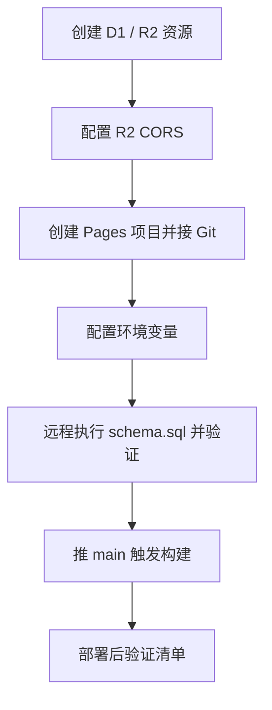

# 部署指南

> hitsound-share 的部署步骤与运维要点，以当前代码为准（`wrangler.toml` / `schema.sql` / `AGENTS.md`）。
> 技术背景与协作约定见 [AGENTS.md](../AGENTS.md)，架构决策见 [docs/adr/](./adr/)。

## 架构与部署形态

- **Cloudflare Pages（Git 集成）**：推 `main` 自动构建部署。首页 shell 预渲染走静态请求，API（`src/routes/api/**`，编译为 Pages Functions）按调用计费——免费计划单请求上限 **50 子请求**（D1/R2 binding 调用都计入），服务端代码不得出现循环逐条调用（详见 AGENTS.md 已知坑）。
- **D1**：`users` / `packages` / `files` / `blobs` / `settings`（schema v6），binding 名 `DB`，库名 `hitsound-share-db`（id 见 `wrangler.toml`）。
- **R2**：音频 blob 内容寻址存储（`blobs/<hash前2>/<sha256>.<ext>`），binding 名 `HITSOUND_FILES`，桶名 `hitsound-files`。上传走浏览器预签名直连、整包下载由浏览器实时拼 zip，服务端只做代理回退。
- **构建配置在 Pages 项目面板（build_config）**：构建命令 `pnpm build`、输出目录由 `wrangler.toml` 的 `pages_build_output_dir` 承载；Node 版本钉在 `.node-version`（大版本号 22）。wrangler.toml 不承载构建命令。
- R2/D1 bindings 由 `wrangler.toml` 声明，Pages 构建时自动应用。



## 一、首次部署

1. **创建资源**
   - D1：`wrangler d1 create hitsound-share-db`（把返回的 `database_id` 填进 `wrangler.toml`）
   - R2：`wrangler r2 bucket create hitsound-files`
2. **R2 CORS**：允许 `https://*.pages.dev` 与 `http://localhost:5173`（本地上调试用）。**更换正式域名后必须同步改 R2 CORS**，否则浏览器直传 / 预签名下载失败。
3. **创建 Pages 项目**：Dashboard → Workers & Pages → Create → Pages → 连接 GitHub 仓库。框架预设选 SvelteKit 或留空均可，构建命令与输出目录以项目设置 / `wrangler.toml` 为准（见上）。
4. **配置环境变量**（Settings → Variables，Production 加密变量，见下表）。
5. **初始化线上 D1**：
   ```sh
   wrangler d1 execute hitsound-share-db --remote --file schema.sql
   ```
   ⚠️ `wrangler d1 execute` 可能**假失败**（报语法错但实际写入成功）：执行后必须 SELECT 验证，例如 `--command "SELECT name FROM sqlite_master WHERE type='table'"` 应列出全部 5 张表；批量写入建议走 D1 HTTP API。
6. **推 `main`** 触发构建部署（部署命令由用户执行，Agent 不代跑 `git push`）。
7. 按「部署后验证」逐项检查。

## 二、环境变量

| 变量 | 必需 | 用途 / 说明 |
| --- | --- | --- |
| `OSU_CLIENT_ID` / `OSU_CLIENT_SECRET` | ✅（上传链路） | osu! OAuth 应用凭证；回调地址 `https://<域名>/api/auth/callback`（默认按请求 origin 推导） |
| `SESSION_SECRET` | ✅（上传链路） | 登录 session HMAC 密钥，`openssl rand -hex 32` 生成 |
| `R2_ACCOUNT_ID` / `R2_ACCESS_KEY_ID` / `R2_SECRET_ACCESS_KEY` | ✅（上传链路） | R2 API Token 三件套，用于预签名直传/直连 |
| `ADMIN_OSU_ID` | 建议 | 唯一超级管理员（部署即固定）；不配则无人能维护管理员名单 |
| `SITE_DEFAULT_PASSWORD` | 可选 | **站点访问密码门**的初始密码。配置即启用；值只存在 Pages 变量里，**不要写进仓库任何文件** |
| `OSU_REDIRECT_URI` | 可选 | 显式 OAuth 回调地址，一般不用配 |

**降级行为（设计如此，非故障）**：上传链路 6 个必需变量任一缺失 → `/api/config` 返回 `uploadEnabled=false` → 前端隐藏登录/上传入口，浏览/试听/下载不受影响。站点访问门未启用（无 `SITE_DEFAULT_PASSWORD` 且 D1 `settings` 无记录）→ 全站不拦。

## 三、schema 版本与升级

当前 **v6**。全新部署直接执行 `schema.sql`（已含全部结构）；存量库按下表顺序补齐，**执行后一律 SELECT 验证**：

| 版本 | 变更 | 线上执行 SQL | 与部署代码的顺序 |
| --- | --- | --- | --- |
| v3→v4 | `packages.append_to`（影子包） | `ALTER TABLE packages ADD COLUMN append_to TEXT;` | **先执行 SQL 再部署代码** |
| v4→v5 | `files.owner_osu_id`（文件级所有者） | `ALTER TABLE files ADD COLUMN owner_osu_id INTEGER REFERENCES users(osu_id) ON DELETE SET NULL;`<br>`UPDATE files SET owner_osu_id = (SELECT uploader_osu_id FROM packages WHERE packages.id = files.package_id);` | 顺序执行、回填前老代码不受影响 |
| v5→v6 | `settings`（站点访问密码） | `CREATE TABLE IF NOT EXISTS settings (key TEXT PRIMARY KEY, value TEXT NOT NULL);` | 幂等，先后皆可（未建表时密码门按未启用降级） |

线上 D1 操作一律显式 `--remote`（不加的默认写进本地模拟器）。

## 四、站点访问密码门运维

- **启用**：配 `SITE_DEFAULT_PASSWORD`（配合 schema v6）。访客须在遮罩输入密码，未解锁时全部 `/api/*` 与 `/f/*`（单文件下载短链）返回 401 `site_locked`；`/api/site-gate`（解锁）与 `/api/config`（返回 `gate.locked`）在白名单内。
- **改密**：管理员（超管或 `users.is_admin` 名单）登录 → 顶栏「管理员」→「站点访问密码」。新 hash 落 D1 `settings`，此后环境变量不再生效；改密后所有已解锁访客会话立即失效，改密者自动获发新解锁 cookie。
- **密码丢失**：超管登录后可直接在线改回（改密入口不依赖旧密码）。
- **彻底关闭门**：删除 `SITE_DEFAULT_PASSWORD` 变量 **并** 清库记录——库记录优先级更高，只删变量门仍在：
  ```sh
  wrangler d1 execute hitsound-share-db --remote --command "DELETE FROM settings WHERE key = 'site_password_hash'"
  ```
- 解锁有效期 30 天；每次校验 1 条 `settings` 主键 SELECT（子请求 +1）。无速率限制，如需抗爆破可后续接 Cloudflare Turnstile。

## 五、日常运维

- **更新部署**：推 `main` 自动构建。涉及 schema 变更先看「三、schema 版本与升级」的顺序要求。
- **管理员名单**：超管在面板维护（`users.is_admin`，撤权即时生效）；名单管理员与超管同权（改密/删除任意内容），但不能动名单。
- **存量 original.zip 清理**（v4 停传后一次性）：admin 登录后 `POST /api/admin/purge-zips`，重复调用至 `remaining: 0`。
- **R2 对象操作**：`wrangler r2 object get/put/list hitsound-files/<key> --remote`（线上必须显式 `--remote`）。
- **回滚**：Pages Dashboard → Deployments → 回退到历史部署即可（代码层）。schema 加列/加表对旧代码向后兼容，无需回滚库。

## 六、部署后验证清单

| 检查 | 期望 |
| --- | --- |
| `GET /` | 200，首页 shell 正常加载 |
| `GET /api/config` | 200；`uploadEnabled` 与变量配置相符；门启用且未解锁时 `gate.locked=true` |
| 门启用时 `GET /api/tree`（无 cookie） | 401 `site_locked`；用初始密码 `POST /api/site-gate` 后带 cookie 访问 → 200 |
| 浏览器整页流程 | 目录树加载、试听播放、单文件/整包下载 |
| 配置了上传变量时 | 登录跳转 osu! OAuth 回调正常、上传对话框可用 |

## 七、本地验证环境（改 API 层后实测用）

快捷命令（justfile 已封装下列安全姿势）：`just setup`（装依赖+子模块+本地 D1）、`just db-init`（重置本地模拟库）、`just pages-dev`（构建+起本地 Functions :8799）。

```sh
direnv allow && pnpm install
wrangler d1 execute hitsound-share-db --local --file schema.sql   # 本地模拟库
pnpm build
```

- 用产物起 Functions：`just pages-dev` 的做法是 cwd 放在仓库外的临时目录（`.env` 搜索链断裂，真实密钥零注入），`wrangler.toml` 副本提供 bindings，产物目录以绝对路径传入（`_worker.js` 的相对 import 依赖其同级 `output/` 与 `cloudflare-tmp/`）。手工版等价做法：在 `.svelte-kit/` 目录级放一份改好输出目录（`cloudflare`）的 `wrangler.toml` 再 `wrangler pages dev cloudflare --port 8799 --persist-to <独立目录> -b KEY=VALUE…`。
- ⚠️ `wrangler pages dev` 会向上级目录搜索并自动加载 `.env` 把真实密钥注入本地进程（cwd 在 `.svelte-kit/` 也会命中 `../.env`）：本地 e2e 一律在仓库外的临时目录启动，`--persist-to` 指独立状态目录，密钥只用 `-b` 传假值。
- 本地模拟状态在 `.wrangler/state`；schema 变更后旧库要整个重置再跑 `schema.sql`（CREATE IF NOT EXISTS 不补列）。
- 访问门在本地同样生效：`-b SITE_DEFAULT_PASSWORD=<测试值>` 模拟启用。
